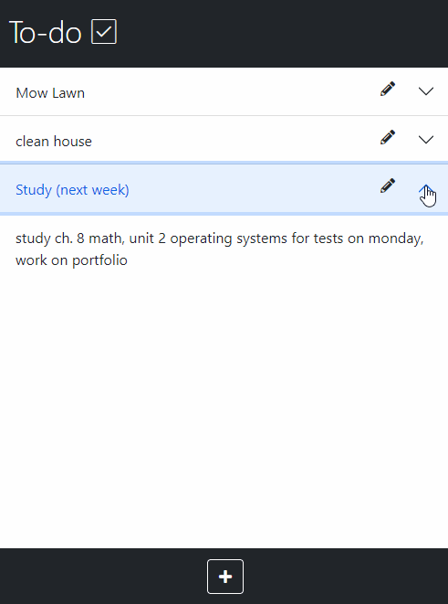


# Full-Stack To-Do App
This is a full stack todo app made with Mongo, Express, Node, JS, and Bootstrap. I built this to reinforce Node and Express concepts while teaching myself how to use a Mongo database. The app has been optimized for smaller screens but is responsive for any size screen.

## Tech Stack

**Client:** Express, EJS, Bootstrap5

**Server:** Node, Express, Mongo, Mongoose

  
## Demo

 

  
## License

[MIT](https://choosealicense.com/licenses/mit/)

  
## Author

**Robin Fussell** _- Software Developer_ | [LinkedIn](https://www.linkedin.com/in/robin-fussell17/)

  
